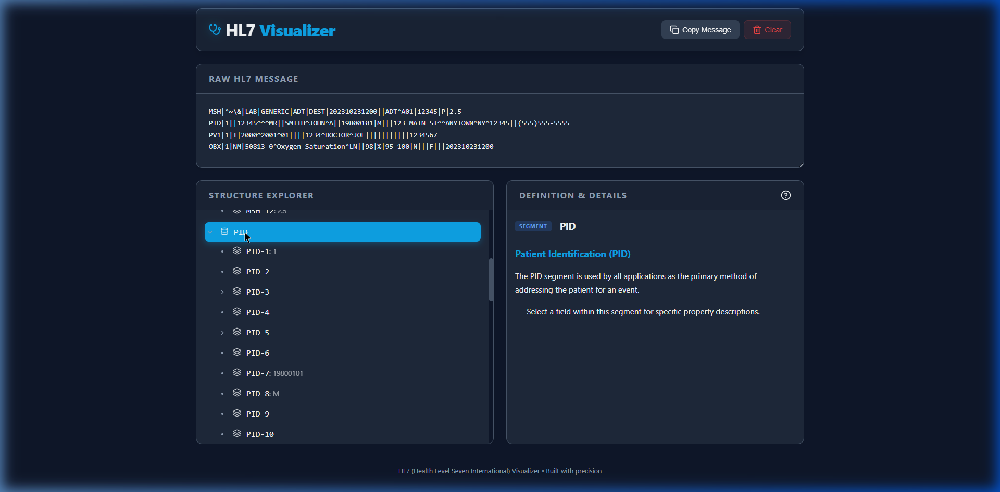

# 🧬 HL7 Visualizer



## 🩺 Overview
**HL7 Visualizer** is a specialized tool developed for healthcare integration engineers and clinicians. It transforms raw, human-unfriendly pipe-delimited HL7 v2 messages into an interactive, hierarchical data structure, providing instant clarity to complex medical data.

## ✨ Key Features
- **Instant Multi-Separator Parsing**: Delimits messages using standard HL7 separators (`|`, `^`, `~`, `&`).
- **Deep Hierarchical Tree**: Navigate through segments, fields, components, and sub-components.
- **Smart Clinical Context**: Click any node to instantly view industry-standard definitions for:
    - **Message Types (MSH-9)**: e.g., ADT, ORM, ORU, VXU.
    - **Trigger Events**: e.g., A01, A04, R01.
    - **Complex Data Types**: XPN (Names), XAD (Addresses), CWE (Coded Data).
- **Premium UX**: Dark mode workspace with glassmorphism design and smooth animations powered by Framer Motion.
- **Responsive Layout**: One-row message input with a split-panel visualization deck optimized for desktop and tablets.

## 🏗️ Architecture
The project follows a clean, component-based React architecture:
- `hl7Parser.ts`: The hierarchical engine that handles splitting by separators and building the recursive node tree.
- `definitions.ts`: A metadata repository for HL7 version 2.x segments, fields, events, and data types.
- `App.tsx`: The primary dashboard coordinating the state between input, tree explorer, and the definition engine.

## 🚀 Getting Started

### Prerequisites
- Node.js (v18+)
- npm

### Installation
1. Install dependencies:
   ```bash
   npm install
   ```
2. Start the development server:
   ```bash
   npm run dev
   ```

## 🛠️ Technical Stack
- **React 18** (Vite-powered)
- **TypeScript** for robust data modeling.
- **Framer Motion** for polished state transitions.
- **Lucide React** for clinical iconography.
- **Pure CSS** for the design system.

---
*Built with precision for the future of healthcare technology.*
