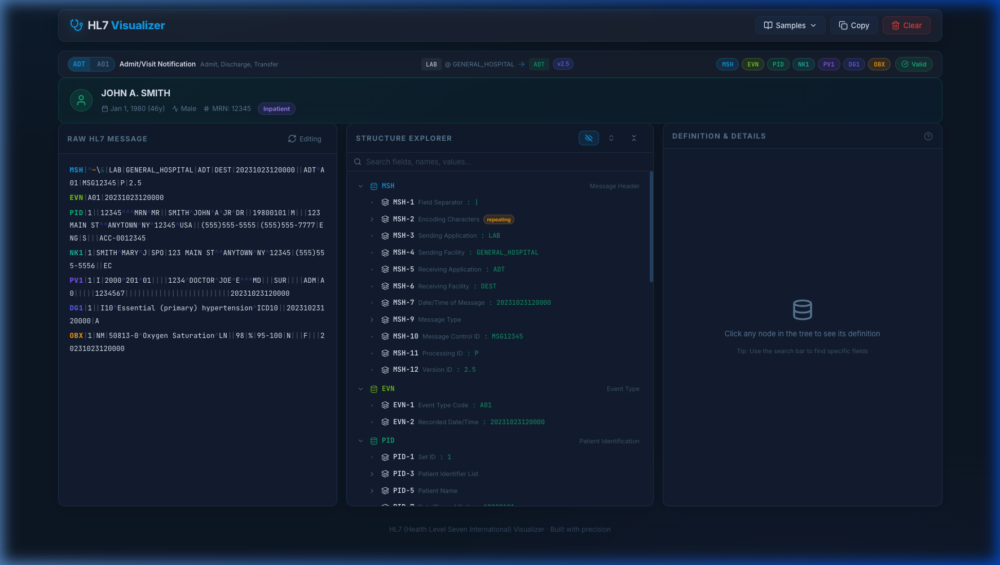
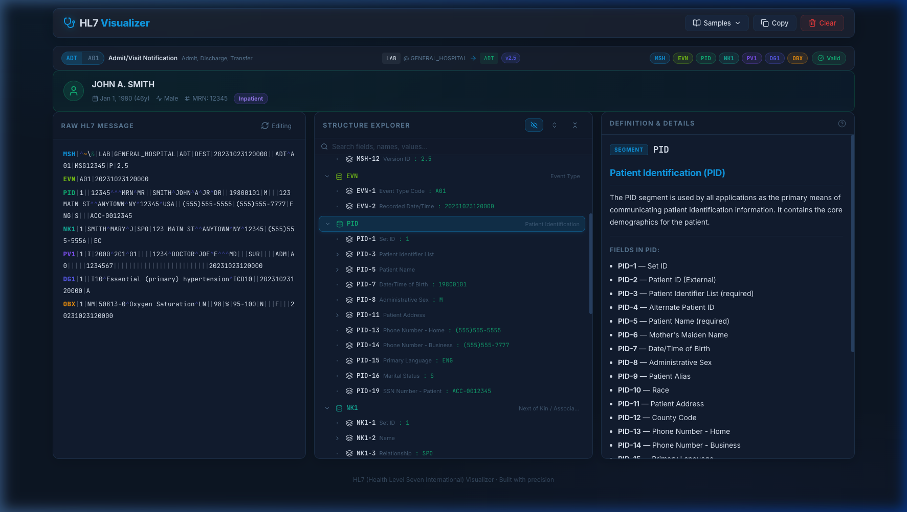
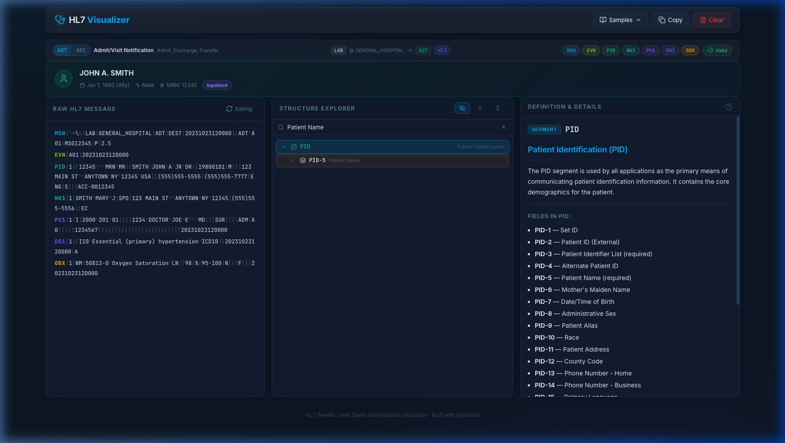
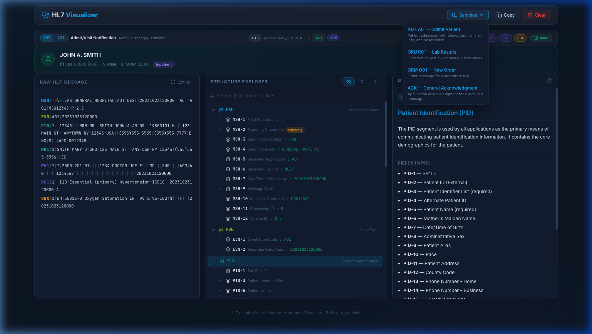
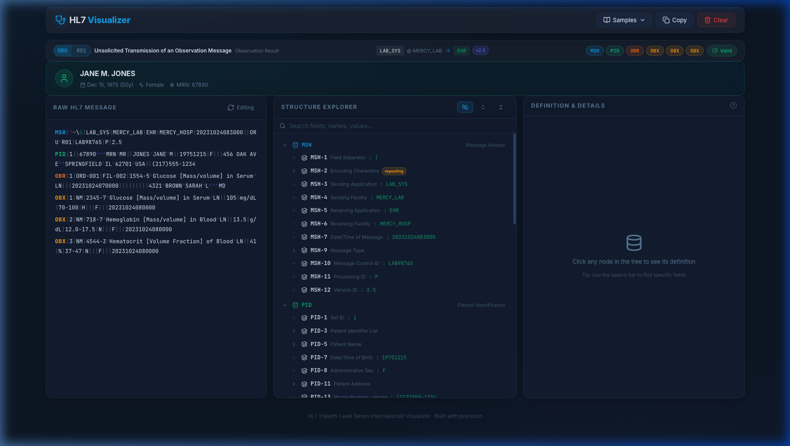

# 🧬 HL7 Visualizer



> **Transform raw, pipe-delimited HL7 v2 messages into a rich, interactive visualization in seconds.**

## 🌐 Live Demo
[https://hl7-visualizer.vercel.app](https://hl7-visualizer.vercel.app)

---

## 🩺 Overview

**HL7 Visualizer** is a specialized tool built for healthcare integration engineers, clinical analysts, and anyone working with HL7 v2 messages. It parses raw pipe-delimited data into a clean, hierarchical interface with instant clinical context — no more staring at incomprehensible pipe strings.

---

## ✨ Features

### 🔝 Smart Message Summary Bar
A context bar at the top that auto-extracts and displays:
- **Message type & trigger event** pill (e.g. `ADT A01 — Admit/Visit Notification`)
- **Message flow** — Sending app → Receiving app with version badge
- **Segment chips** — Clickable to jump instantly to any segment in the tree
- **Validation badge** — `✓ Valid` or `⚠ N errors` at a glance

### 👤 Patient Summary Card
When a PID segment is detected, automatically surfaces:
- Full formatted patient name, Date of Birth (with calculated age)
- Sex, MRN, Account Number
- Patient class badge (Inpatient / Outpatient / Emergency)

### 🌳 Structure Explorer
- **Deep hierarchical tree**: Segments → Fields → Components → Sub-components
- **Field names inline**: Every node shows its human-readable name (e.g. `PID-5 Patient Name`)
- **Hide empty fields** toggle — removes clutter from fields with no values (on by default)
- **Search & filter** — Search across labels, field names, and values in real-time
- **Expand / Collapse All** controls
- **Repeating fields** (`~`) tagged with a `repeating` badge

### 📝 Syntax-Highlighted Raw View
- Segment names **color-coded** per segment type
- Separators subtly highlighted: `|` `^` `~` `&` in distinct colors
- Click-to-edit — switch between preview and raw edit mode

### 📚 Sample Message Library
4 built-in real-world samples to explore:
- ADT A01 — Patient Admission
- ORU R01 — Lab Results
- ORM O01 — New Order
- ACK — General Acknowledgment

### 📖 Definition & Details Panel
Click any tree node to instantly see:
- Segment/field full name and description
- Required field indicators
- **Data type breakdowns** (XPN, XAD, CWE, XCN, PL, MSG, ...)
- Enumeration explanations (e.g. `M=Male, F=Female`, `I=Inpatient`)
- MSH-9 special handling — decodes message type + trigger event

### ✅ Validation
- Detects missing MSH, empty required fields, malformed message type
- Errors and warnings shown inline

---

## 📸 Screenshots

### Main Overview — ADT A01 Admit Message


### Definition Panel — Patient Identification (PID)


### Smart Search & Filter


### Sample Message Library


### ORU R01 — Lab Results Message


---

## 🏗️ Architecture

```
src/
├── hl7Parser.ts      — Hierarchical parser with repeating fields, escape decoding & validation
├── definitions.ts    — Metadata for 12+ HL7 v2.x segments, data types, message/event codes
└── App.tsx           — Main dashboard: summary bar, patient card, tree, definition panel
```

**Key design decisions:**
- `hl7Parser.ts` handles `~` repeat separators natively (parsed as sibling nodes)
- HL7 escape sequences (`\F\`, `\S\`, `\E\`, etc.) are decoded before display
- Validation runs on every keystroke — zero-dependency, pure TypeScript

---

## 🚀 Getting Started

### Prerequisites
- Node.js v18+
- npm

### Local Development
```bash
# Install dependencies
npm install

# Start dev server
npm run dev
```

### Docker
```bash
docker compose up -d
```

---

## 🛠️ Tech Stack

| Technology | Purpose |
|---|---|
| **React 19** + **Vite** | UI framework and build tool |
| **TypeScript** | Type-safe data modeling |
| **Framer Motion** | Panel animations and tree transitions |
| **Lucide React** | Clinical-grade iconography |
| **Vanilla CSS** | Custom design system (no framework) |
| **Google Fonts** | Inter (UI) + JetBrains Mono (code) |

---

## 📋 Supported HL7 Segments

| Segment | Name | Color |
|---|---|---|
| MSH | Message Header | Sky Blue |
| EVN | Event Type | Lime |
| PID | Patient Identification | Emerald |
| NK1 | Next of Kin | Teal |
| PV1 | Patient Visit | Violet |
| AL1 | Patient Allergy | Red |
| DG1 | Diagnosis | Indigo |
| ORC | Common Order | Pink |
| OBR | Observation Request | Orange |
| OBX | Observation/Result | Amber |
| IN1 | Insurance | Lavender |
| GT1 | Guarantor | Light Orange |
| MSA | Message Acknowledgment | Cyan |

---

*Built with precision for the future of healthcare technology.*
